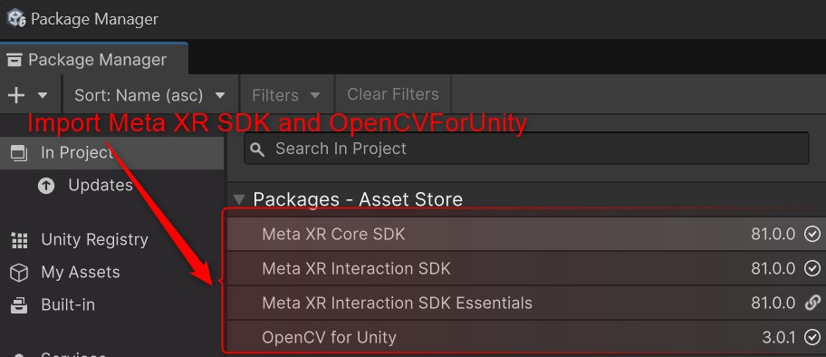
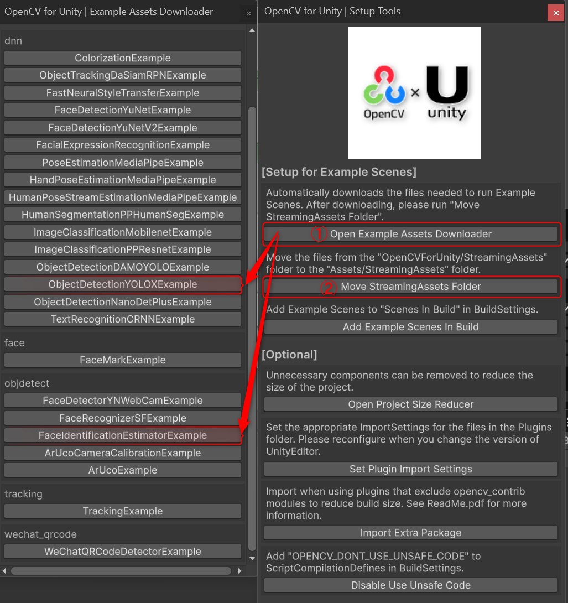
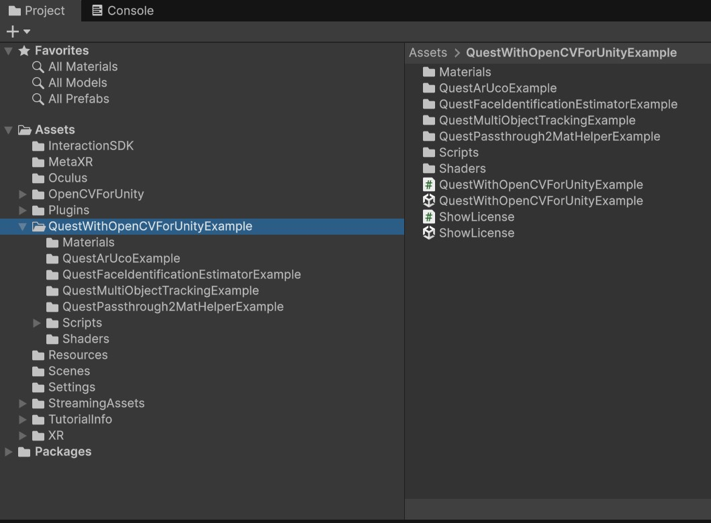
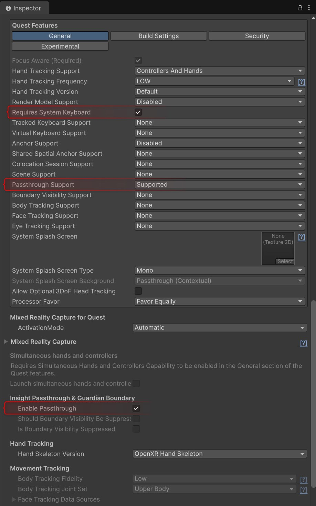
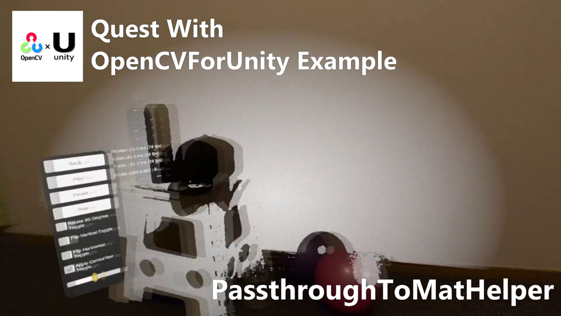
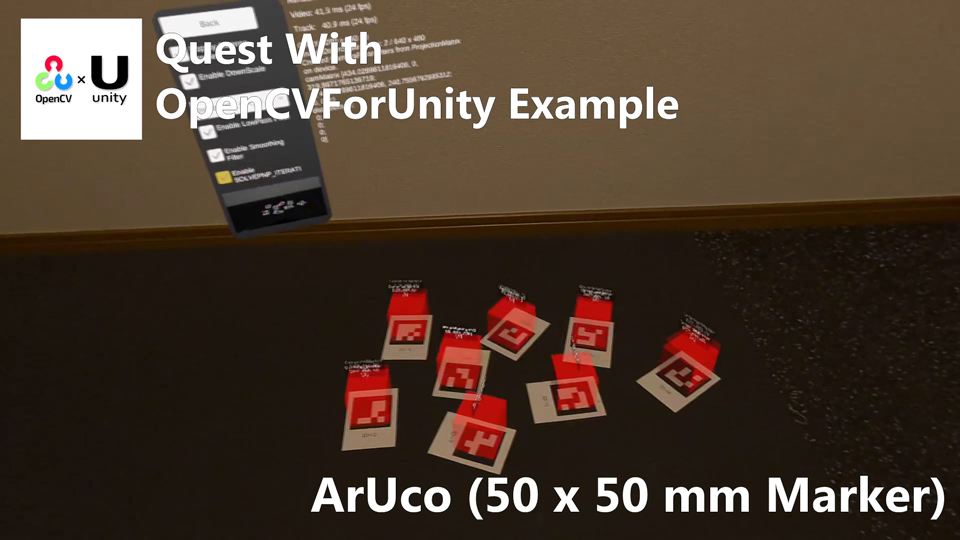
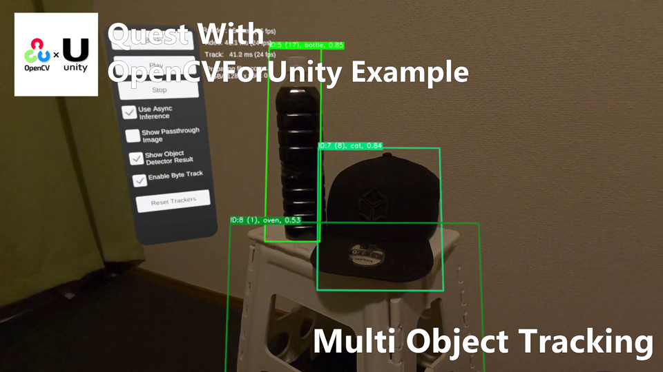
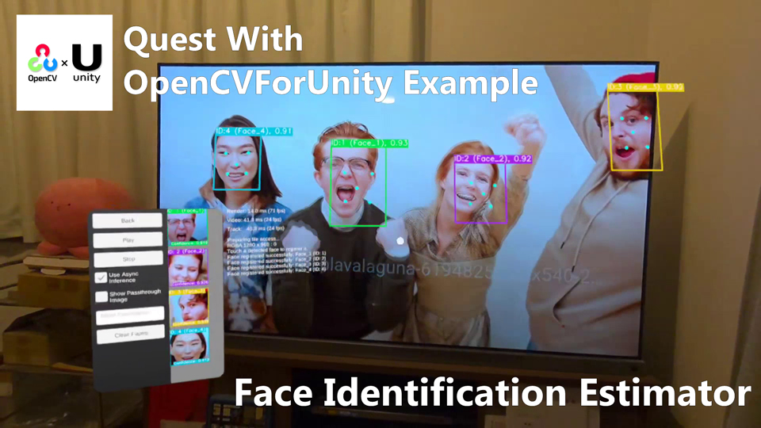

# Quest With OpenCVForUnity Example

## Overview
This repository provides a collection of Unity sample projects demonstrating how to use the Meta Quest 3 / 3S passthrough camera in combination with OpenCVForUnity to achieve various computer vision tasks in mixed reality.
Each example focuses on a practical workflow that can run directly on-device, enabling developers to prototype and build MR applications with real-time image processing and AI-based recognition.

The project includes the following samples:

* Comic Filter (Image Processing)
Demonstrates real-time image effects using OpenCV operations applied to the passthrough camera feed.

* Marker-based AR (Aruco)
Shows how to detect ArUco markers through the passthrough view and place virtual objects stably in the physical environment.

* Object Detection with YOLOX (OpenCV DNN)
An example of running YOLOX object detection models via OpenCV’s DNN module on Meta Quest, visualizing detection results in MR space.

* Face Detection & Recognition (OpenCV DNN)
Demonstrates a full face-processing pipeline including face detection, feature extraction, face registration, and real-time face identification.

These examples serve as practical references for integrating passthrough camera input with OpenCV-based processing on Meta Quest devices, helping developers explore advanced MR computer vision scenarios.

## Demo Video

## Environment
* Meta Quest 3S
* Unity 6000.0.59f2 / URP / OpenXR
* [Meta Core XR SDK](https://assetstore.unity.com/packages/tools/integration/meta-xr-core-sdk-269169?aid=1011l4ehR) 81.0.0
* [Meta Interaction SDK](https://assetstore.unity.com/packages/tools/integration/meta-xr-interaction-sdk-265014?aid=1011l4ehR) 81.0.0
* [OpenCV for Unity](https://assetstore.unity.com/packages/tools/integration/opencv-for-unity-21088?aid=1011l4ehR) 3.0.1+ 

## Setup
1. Download the latest release unitypackage. [QuestWithOpenCVForUnityExample.unitypackage](https://github.com/EnoxSoftware/QuestWithOpenCVForUnityExample/releases)
1. Create a new project. (`QuestWithOpenCVForUnityExample`)
    * Change the platform to `Android` in the "Build Settings" window.
1. Setup Unity for VR development.  [Set up Unity for VR development](https://developers.meta.com/horizon/documentation/unity/unity-project-setup/)
    * Install the Unity OpenXR Plugin. (Option A)
    * Import the `Meta Core XR SDK` and `Meta Interaction SDK` from [Meta Quest Unity Asset Store](https://assetstore.unity.com/publishers/25353).
1. Import and setup the OpenCVForUnity.
    * Select MenuItem[Tools/OpenCV for Unity/Open Setup Tools].
    * Open [Example Assets Downloader] and click the buttons for `ObjectDetectionYOLOXExample` and `FaceIdentificationEstimatorExample` to download the dependent assets into your project.
    * Click the [Move StreamingAssets Folder] button.
    * Leave the following files and delete the rest. 
    ("StreamingAssets/OpenCVForUnityExamples/dnn/coco.names",
     "StreamingAssets/OpenCVForUnityExamples/dnn/yolox_tiny.onnx",
     "StreamingAssets/OpenCVForUnityExamples/objdetect/face_detection_yunet_2023mar.onnx",
     "StreamingAssets/OpenCVForUnityExamples/objdetect/face_recognition_sface_2021dec.onnx")
1. Import the QuestWithOpenCVForUnityExample.unitypackage.
1. Add the following permissions to `Assets/Plugins/AndroidManifest.xml`.
    * Open **Project Settings > Player > Android > Publishing Settings**
    * Enable **Custom Main Manifest**
    * In `Assets/Plugins/Android/AndroidManifest.xml`, ensure the following entries are present **inside the `<manifest>` tag**:
    * `<uses-feature android:name="com.oculus.feature.PASSTHROUGH" android:required="true" />`
    * `<uses-permission android:name="horizonos.permission.HEADSET_CAMERA" />`
1. Add the "Assets/QuestWithOpenCVForUnityExample/*.unity" files to the "Scenes In Build" list in the "Build Settings" window.
1. Build and Deploy.
    * (Please print the AR marker “ArUcoMarkers_DICT_4X4_50_0-8.pdf” on A4-sized paper and have it ready, as it is required for testing QuestArUcoExample)  

|PackageManager|SetupTools|
|---|---|
|||

|ProjectWindow|QuestFeatures_General|
|---|---|
|||

## ScreenShots
 

 

 

 

